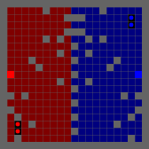
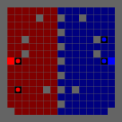
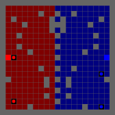

# Projekt
Vi ville utforska Reinforcement learning.
Frågorna vi ställde oss i början var "Hur kan reinforcement learning implementeras för att spela Capture the Flag?" 
"Hur implementerar vi hyperparametrarna vid träning för att förbättra agenten och göra den smart?" dvs att få agenten att spela mer strategiskt och effektivt.
"Hur många spelare ska spela samtidigt?"

Vi började att utforska 1vs1 för en stadig grund. Vi gick sedan vidare till 2vs2 med rollfördelning där defendern kan "tagga" motståndarens attacker som har tagit flaggan. Vid taggning så skickas egna flaggan tillbaka till sin bas och motståndaren skickas tillbaka till sin originella startpunkt. Spelplanen består av ett 17x17 grid. Väggar och spelarnas startpositioner är slumvist utplacerad på spelplanen för att göra det mer komplext och tvinga agenterna till att hitta smartare lösningar. Spelhalvorna är symmetriska för att undvika "unfair advantage" för något lag. 
Spelarna ser bara en del av världen, sex rutor framåt och tre åt vardera sida, 7x7. Detta blir input som konverteras till en tensor och skickas till CNN som beräknar vilken typ av handling som ger högst reward. 
Vikterna i detta projekt styr beslutsfattningen. Agenten tar ett beslut som den tror kommer maximera reward för spelaren, inte för spelet i sin helhet. Den kommer inte ihåg vad de andra spelarna gjorde vilket leder till isolerade spelare. Detta betyder att varje spelare styrs av en egen agent även om det delar samma vikter. 

För att besvara på frågan vad gällande implementering av RL för CTF så använde vi dessa moduler och verktyg:
###### Gymnasium 
Utgör grundstommen i vårat projekt och hanterar det mesta som sker under ytan. Den hanterar game loopen med step(), initierar spelplanen med reset(), hantera tre handlingar agenten tar med Descrete(3) och definierar inputen via Box() dvs hur många färgkanaler, högsta och lägsta pixel-värde, bildstorlek och bildformat.  

###### Minigrid  
bygger *Gymnasium* och används för att skapa och rendera den 2D spelvärld agenten existerar i. Den tar 17x17 gridet och skalar upp den så varje koordinat blir en 12x12 pixel stor ruta. 
Modulen kommer också med färdig-definierade objekt som väggar, golv, spelare, dörrar osv. Den hanterar också regler för navigering genom miljön. 

###### Supersuit 
är hjälpfunktionen som kontrollerar att datan från *Minigrid* matchar Box() från *Gymnasium*. Den korrigerar datan om den är i fel format så att våran PPO-algoritm inte kraschar. Den plattar ut datan så att *StableBaseline3* kan hantera den. Den hanterar även Frame Stacking, sammanfogning av tre bilder till en sekvens för att ge kontext till inlärningen. 

###### StableBaseLine3 
hanterar neurala nätverket, gradient och uppdaterar vikterna under träning. Obervationen och rewards tas in och tar beslut om vilka vikter som ska uppdateras. 

###### PettingZoo 
krävs för att hantera multi-agent scenario. 

Vi jobbade på egna branches och gjorde pull requests för att mergea in i main-branch efter att koden hade granskats/godkänd. Standups var lite mer flytande men vi såg till att ha några per vecka. Mål sattes och stämdes av vid varje standup. 

# Eget Bidrag
Alla i gruppen var med och utvecklade flera olika delar, gemensamma beslut togs alltid och vi hjälpte varandra. 
Så vi jobbade gemensamt mot samma mål.

Min del av grupparbetet bestod av att undersöka samt implementera 2vs2 agenter. Detta för att vi ville ha rollbaserade agenter i vardera lag. Agenterna spawnar in random och för att tilldela roller räknas avståndet ut med manhattan distance till egna flaggan. Närmast avstånd till egna flaggan blir defender, den andra blir då automatiskt attacker. Jag kopplade även olika rewards till de olika rollerna för att försöka få agenten att hålla sig till sin fördelade roll.  
För att göra spelet mer interaktivt från agenternas perspektiv så lades frame stacking till i koden. Detta gör så att agenterna lättare kan "förutspå" motståndarens rörelse, vilket hjälpte både defender och attacker. Frame stacking ger agenten möjligheten att tolka rörelser snarare än isolerade ögonblick. Brus i beslutsprocessen minskar och leder till en stabilare policy. Agenten kan basera sitt agerande på trender i rörelsemönstret istället för enstaka missledande bildrutor. 

# Träning och inferens
Träningen genomfördes med PPO-algoritmen i en Self-Play-miljö. Där vi tränade modeller för att maximera sina rewards genom miljontals steg. Träningen var uppdelad i olika steg. Första träning var 1 miljon steg, andra träningen var 2 miljoner steg och tredje träningen var på 2 miljoner steg. Detta för att göra det enklare att se om något gick fel och då kunde man enkelt träna om från grunden eller fortsätta träningen om det såg bra ut. Man kunde alltså enkelt "tweaka" reward policy och sedan träna om. Under varje träning så kunde vi enkelt följa agentens agerande genom print statements. "Blue_1 picked up flag!", "Red_2 tagged Blue_1" och "Blue_2 Scored" för att nämna några olika scenarier. 
Den sista träningen, från 5 miljoner till 7 miljoner steg, så sänktes learning rate och entropy coefficient för att minska exploration och istället öka användning av inlärda strategier. Resultatet av detta var lägre varians i beteende och tydligare rolluppfyllnad under inferens. 
Att läsa och försöka tolka de olika värden som man fick under träning var också ett bra sätt att hålla koll på hur träningen gick. 

###### Entropy_loss
används som ett mått på hur utforskande agenten var, ett högre värde indikerar mer slumpmässiga handlingar. Ett lägre värde tyder på att policyn har blivit mer deterministisk. Under träningen kunde man se en minskning gradvis av entropy loss. Agenten gick då från utforskande till mer exploatering av inlärda strategier.   

###### Explained_variance 
användes för att mäta hur väl värdefunktionen förklarar variationen i de  rewards. Om värdet är nära 1 indikerar de att modellen gör bra prediktioner av framtida belöningar, medan ett värde nära eller under 0 tyder på instabil eller ineffektiv inlärning. Under senare träningssteg förbättrades explained variance, vilket tydde på att värdefunktionen anpassades bättre till miljön.

###### Value_loss
representerar felet mellan predikterad value och faktisk return. Ett högt värde kan betyda en instabil träning eller dåligt anpassad reward policy. Genom att justera rewards och införa straff för passivt beteende kunde value loss stabiliseras över tid.

Efter avslutad träning så använde vi den sparade PPO-modellen i "inferensläge" där våra vikter frystes och ingen uppdatering av policyn skedde. Det man snabbt kunde se, eftersom träningen var uppdelad i olika steg, var att titta på vart fokus låg. Det vill säga att fokuset låg på beteenden som rörelsemönster, rolluppfyllnad, samspel inom laget och flagg interaktioner. Så genom att jämföra agenternas beteende under inferens med beteenden observerade tidigt i träningen kunde tydliga förbättringar ses, bland annat mer målinriktad navigation, färre kollisioner med väggar och bättre timing vid flaggplock och taggning. I gifsen nedan kan vi se när ett lag vinner, ett lag försvarar och sedan random walls och spelar positioner.

    

# Problem
Att tilldela roller visade sig vara svårare än planerat. Rollerna skickades enbart med som en textsträng i början vilket betydde att de aldrig fick några roller eftersom det bara fick med en extra text-sträng och ingen aktiv roll. Lösningen var att skicka med agent + roller som en Dictionary. 
CnnPolicy i träningsstadiet behövde ändras till MultiInputPolicy. Transponering krävdes av bilddata från HWC till CHW vid implementering av frame stacking. Vi stötte på en mängd problem med balansering av reward policyn. Gränsen var hårfin mellan att få ett felfritt försvar eller att båda agenterna gick direkt för flaggan och hem till egen bas. Reward farming var också ett stort problem. Modellerna vi tränade kunde lätt hamna i lokal minima. Detta kunde betyda att agenterna bara stod helt stilla eller sprang in i väggar och hamnade i "Deadlock".
Lösningen på detta var att implementera mer reward policys. Team versioner av rewards introducerades vilket var tänkt att skapa mer strategiska lösningar och ge belöning när fler saker gick rätt helt enkelt. Dessutom lades en penalty till ifall agenten stod stilla, då fick agenten minuspoäng. 

Ett generellt problem var den angivna tiden som gavs för projektet. Detta visade sig dock vara en bra träning på att planera väl, strukturera och reflektera över vad vi behövde prioritera som grupp. Att få en grundmodell att fungera var prioritering 1. Sedan kunde vi bygga vidare och implementera 2vs2 osv. 

# Slutsats och future improvements
Att ha något som fungerar är viktigare än att göra ett för komplext projekt från början som aldrig blir löst. Att förklara något som fungerar är också mer imponerande än att visa upp något som inte fungerar med häftiga idéer. 

Vi pratade i gruppen att om tiden hade funnits så hade vi försökt implementera kreativa koncept så som vapen för att göra spelet mer interaktivt och underhållande. 
Utforska med EDA på vikterna och se om de olika spelarna aktiverar olika vikter. 
En annan förbättring är miljön och grafiken/upplägget. Möjliga förbättringar och mer komplexa lösningar/hinder. 
Uppepå dessa förslag på förbättringar så hade träningstiden ökat vilket hade vart intressant att se hur "smarta" spelarna hade blivit. 